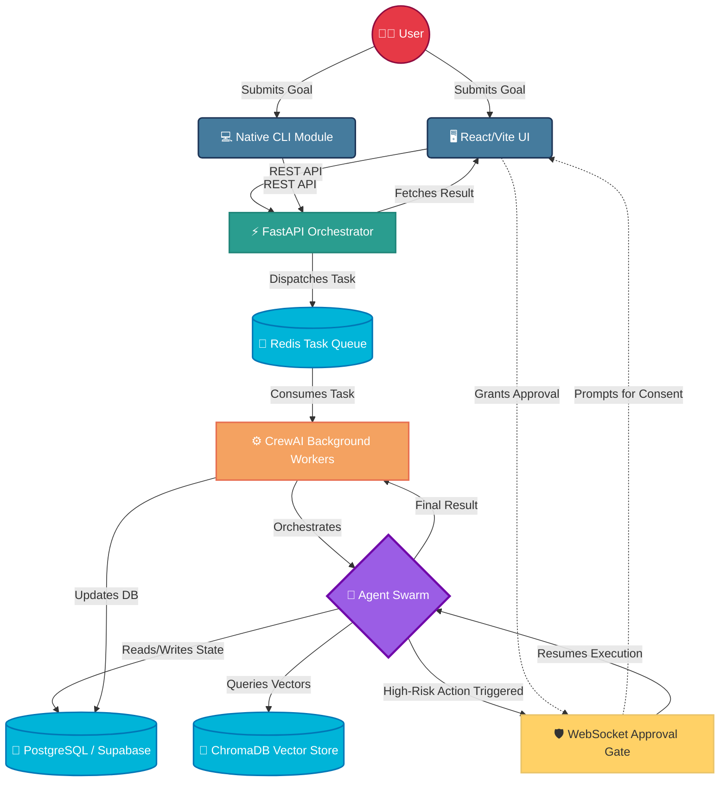
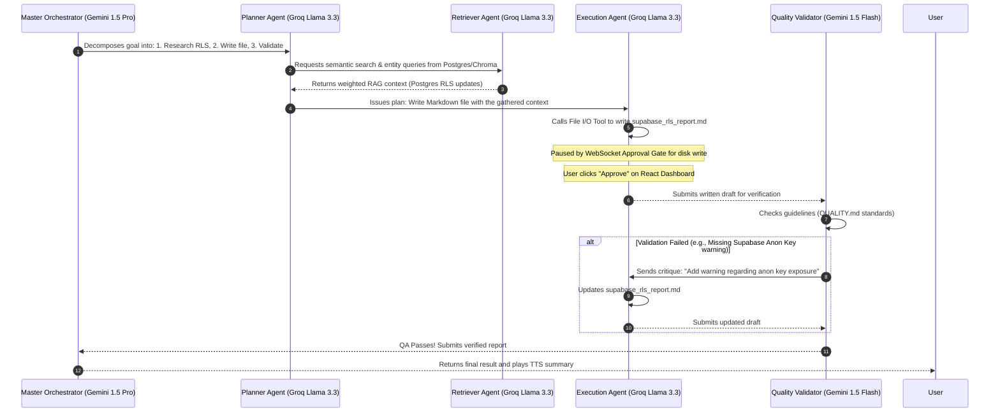
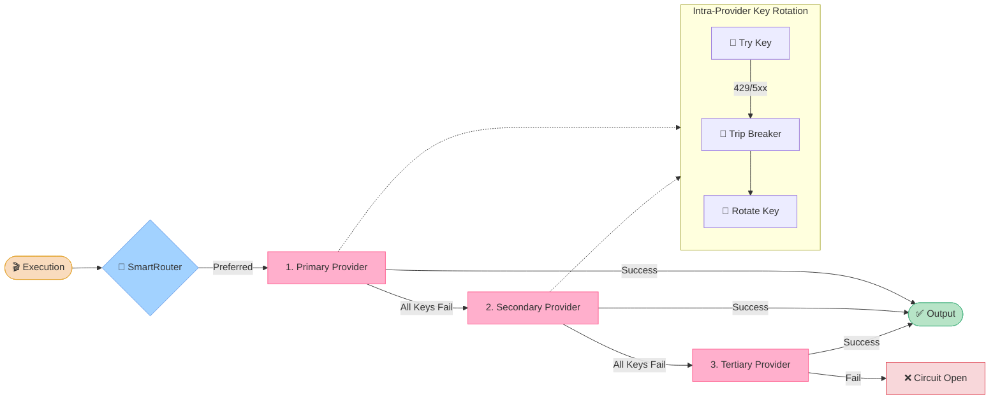
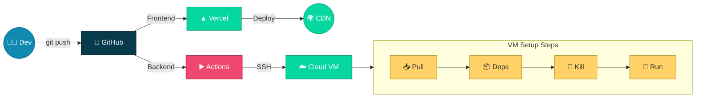

# 🌀 Nexsus — Agent Swarms Orchestrator

**Nexsus** is a production-grade, multi-agent AI orchestration platform built for the **Nationwide Microsoft Hackathon** under the official **Agent Swarms** theme.

> ### 🏆 Agent Swarms
> *"One agent is useful. A swarm of agents working together? That's a different game entirely. This theme is about orchestrating multiple AI agents (planners, retrievers, executors, validators) that collaborate, self-organize, and solve complex multi-step problems no single agent could handle alone. This is distributed AI architecture at its finest: containerized, scalable, and seriously impressive when it works."*

Presented with pride by **Team Nexsus**.

<br>
<div align="center">


</div>

---

## 🌟 The Vision

Complex problems require a team. Traditional single-agent systems suffer from context saturation, hallucinations, and rigidity when faced with massive, ambiguous goals. **Nexsus** dismantles the single-agent bottleneck. By centralizing cognitive orchestration and distributing workloads across specialized agent microservices, we shift the user from being a manual "Prompt Engineer" to an "Executive Approver."

### Key Innovations:
*   **Role-Based Collaboration Network:** A dynamic execution graph of Orchestrators, Planners, Retrievers, Executors, and Validators.
*   **Tri-Store Memory & Semantic RAG:** Combines PostgreSQL (Relational State), ChromaDB (High-dimensional Vector Semantics), and Redis with Algorithmic Memory Decay.
*   **The Approval Gate (Human-in-the-Loop):** A risk-aware middleware intercept layer. The system pauses and requests cryptographic WebSocket approval before executing any risky real-world mutations.
*   **Resilient LLM Dispatcher:** Achieves zero-cost uptime by intelligently routing tasks and gracefully failing over across inference endpoints.

---

## 🚀 Tech Stack

*   **Frontend Interface:** React, Vite, Zustand, TailwindCSS (Glassmorphism Design), Framer Motion
*   **Core Backend:** Python, FastAPI, Uvicorn, WebSockets
*   **AI & Agents:** CrewAI, LangGraph, spaCy (NER Extraction), OpenAI-Whisper (STT)
*   **APIs & Inference:** Gemini 1.5 Flash, Groq (Llama-3-70b), OpenRouter, Serper.dev
*   **Databases & Memory:** PostgreSQL (Supabase), ChromaDB, Redis
*   **CI/CD & DevOps:** GitHub Actions, Docker, Cloud VMs, Vercel Cloud, Supabase Cloud

---

## 🏗️ System Architecture & Data Flow

Nexsus is built on a distributed microservices architecture to ensure scalability and separation of concerns.

### 🌐 High-Level System Architecture



### 🤖 Agent Swarm Collaboration Flow

```mermaid
flowchart LR
    classDef orchestrator fill:#ff006e,stroke:#830037,stroke-width:2px,color:#fff,rx:10,ry:10;
    classDef planner fill:#3a86ff,stroke:#004bba,stroke-width:2px,color:#fff;
    classDef retriever fill:#8338ec,stroke:#4a00b0,stroke-width:2px,color:#fff;
    classDef executor fill:#ffbe0b,stroke:#a67b00,stroke-width:2px,color:#333;
    classDef validator fill:#fb5607,stroke:#a33400,stroke-width:2px,color:#fff;

    Master[👑 Master Orchestrator]:::orchestrator
    Planner[🗺️ Planner Agent]:::planner
    Retriever[🔍 Retriever Agent]:::retriever
    Executor[🛠️ Execution Agent]:::executor
    Validator[⚖️ Quality Validator]:::validator
    
    Master -->|Receives Goal| Planner
    Planner -->|Formulates Steps| Retriever
    Retriever -->|Gathers Context via RAG| Executor
    Executor -->|Drafts Solution| Validator
    Validator -->|Checks and Fixes| Master
    Validator -.->|If Fails| Executor
```



### The Swarm Execution Flow:
1. **Goal Ingestion (User Interface):** The user submits a complex objective via the React Dashboard or the native CLI module.
2. **Orchestration (FastAPI Core):** The backend receives the goal. The Master Orchestrator agent analyzes the objective and breaks it down into distinct, specialized tasks.
3. **Distribution (Queue System):** These tasks are dispatched into a Redis message queue, separating the API layer from heavy AI processing.
4. **Execution (CrewAI Workers):** Specialized asynchronous Python workers pick up the tasks. Agents collaborate using LangGraph, querying ChromaDB for vector memory and PostgreSQL for relational context.
5. **Human-in-the-Loop (WebSocket Intercept):** If an agent decides to execute a high-risk action (like making an API call or modifying a database), execution is paused. A real-time WebSocket event is fired to the frontend's **Approval Center**, waiting for the Executive Approver's consent.
6. **Synthesis & Voice (Output):** Upon approval and task completion, results are aggregated and sent back to the client. Optional TTS (Text-to-Speech) and Whisper consumers can process audio interactions.

### 🏃‍♂️ Swarm in Action: Real-World Case Study

To showcase the **collaboration, self-organization, and self-healing** of the swarm, here is a trace of how Nexsus executes a complex multi-step objective:

> **Goal:** *"Generate a security report for the recent Supabase Postgres RLS updates, write a summary file to the workspace, and verify its quality."*



*   **Self-Healing & QA Loops:** The Executor and Validator agents run in a **QA Critic Loop**. If the Validator detects a hallucination or structural issue, it does not fail the run. It issues a critique back to the Executor, which self-heals and corrects the work dynamically.
*   **Context Fusion:** During RAG retrieval (Step 3), the Retriever queries ChromaDB vectors (60%), Postgres full-text search (25%), and spaCy NER overlap entities (15%) simultaneously to build a comprehensive context payload.

---

## 🛡️ Resilient LLM Dispatcher & Multi-Provider Failover

To guarantee **zero downtime** and **rate-limit (HTTP 429) immunity** during intense demo flows, Nexsus implements a robust, two-level resilient dispatching architecture.

### 🔄 Failover Mechanism
1. **Level 1 (Intra-Provider Key Rotation):** 
   For the selected provider, the system loads a pool of API keys (e.g., `GEMINI_API_KEY_1`, `GEMINI_API_KEY_2`, ..., `GEMINI_API_KEY_N`). If a key hits a rate limit or encounters an API error:
   - The key is marked as failed in Redis, tripping its local **Circuit Breaker** (which stays open for 30 minutes to bypass further requests).
   - The system immediately rotates to the next available key in the provider pool without terminating the request.
2. **Level 2 (Inter-Provider Failover):**
   If all keys in the primary provider's pool are exhausted or circuit-broken, the request dynamically falls back to the next provider in the chain:
   $$\text{Gemini (Flash/Pro)} \longrightarrow \text{Groq (Llama-3)} \longrightarrow \text{OpenRouter (Mistral/Llama Free)}$$

### 🧠 SmartRouter Affinity Routing
Different agent roles have affinities mapped to specific models to balance cost, speed, and reasoning depth:
* **Guardians & Validators:** Routed to `Gemini 1.5 Flash` (ultra-fast, extremely cost-effective validation).
* **Planners, Retrievers, & Executors:** Routed to `Groq Llama-3.3-70b` (strong complex reasoning and context synthesis).
* **Orchestrators:** Routed to `Gemini 1.5 Pro` (deep multi-step coordination).

If an agent's preferred provider fails, the failover sequence automatically triggers starting from the next-preferred provider.

### 📊 Fallback Sequence Diagram



---

## 🖥️ User Interface (Dashboard) Features

The React/Vite Glassmorphism dashboard is carefully designed to shift the user from a traditional "Prompt Engineer" to an "Executive Approver." Every element on the UI serves a specific cognitive or security purpose:

| 🎛️ UI Element / Option | 🎯 Purpose & Reason | 🛠️ Underlying Technology |
| :--- | :--- | :--- |
| **Goal Input Box** | The primary entry point. Users define overarching, ambiguous goals instead of micro-managing prompts. | React State + FastAPI Goal Ingestion |
| **Agent Trace Cards** | Real-time observability. Shows exactly what each agent (Planner, Retriever, Executor) is currently doing and thinking. | `AgentTraceCard.tsx` + Redis Task Queue |
| **Approval Gate (Modal)** | The ultimate security checkpoint. Pauses the swarm before any destructive action (API call, DB write) and waits for human cryptographic consent. | WebSocket Interception + Zustand State |
| **Memory / Context Panel** | Transparency. Shows what external data or past memories the agents are pulling to solve the current step to prevent LLM hallucinations. | Semantic RAG + ChromaDB / Postgres |
| **Keyboard Shortcuts** | Power-user accessibility. Allows lightning-fast approvals or swarm cancellations without touching the mouse. | `ShortcutsModal.tsx` + Event Listeners |
| **Auth & Route Guards** | Ensures that the user overseeing the swarm is cryptographically verified to approve sensitive tasks. | Firebase Auth + `RouteGuard.tsx` |

---

## 💻 Terminal Support (CLI)

Nexsus features native terminal support for seamless developer interaction. You can launch, monitor, and configure swarms directly from your command line using our custom PowerShell module (`nexsus.ps1`).

### Install via CLI
```powershell
irm https://agents-swarm.vercel.app/cli/install.ps1 | iex
```

### Authentication

Before using the CLI, you need to generate a personal API Key:
1. Log in to the [Nexsus Dashboard](https://agents-swarm.vercel.app/).
2. Navigate to the **API Keys** section in the sidebar.
3. Click **Create new secret key** and copy your `nx-sk-...` token.
4. Set it as an environment variable in your terminal:

```powershell
[Environment]::SetEnvironmentVariable('NEXSUS_API_KEY', 'nx-sk-your-secret-key', 'User')
$env:NEXSUS_API_KEY="nx-sk-your-secret-key"
```

### Usage
Once installed and authenticated, you can use the `nexsus` command globally:
```powershell
nexsus --help
nexsus run "Analyze quarterly earnings"
nexsus system status
```

---

## ⚡ Quick Start (Local Development)

1. **Configure Backend credentials:** 
   ```bash
   cp .env.example .env
   # Insert your API keys (Gemini, Groq, Firebase, Supabase, etc.)
   ```

2. **Configure Frontend credentials:** 
   ```bash
   cd frontend
   cp .env.example .env
   # Insert your Firebase client credentials
   cd ..
   ```

3. **Spin up core services (Redis, ChromaDB, Postgres):** 
   ```bash
   docker-compose -f docker-compose.dev.yml up -d
   ```

4. **Launch the FastAPI Backend:**
   ```bash
   pip install -r backend/requirements.txt
   uvicorn backend.main:app --reload --port 8000
   ```

5. **Start the asynchronous Crew Workers:**
   ```bash
   python -m backend.workers.crew_consumer
   ```

6. **Spin up the React Dashboard:**
   ```bash
   cd frontend
   npm install
   npm run dev
   ```

---

## ☁️ CI/CD & Deployment Strategy

Nexsus utilizes a fully automated, multi-branch CI/CD pipeline for frictionless updates:



*   **Frontend (Vercel):** Any push to tracked branches automatically triggers a Vercel build, ensuring the Glassmorphism UI is always up-to-date globally.
*   **Backend (Cloud VM via GitHub Actions):** A custom, highly resilient deployment workflow (`deploy-vm.yml`) handles backend VM rollouts. 
    * It connects to the Cloud Virtual Machine securely via SSH.
    * Dynamically pulls code based on the triggering branch (`main` or `pipeline`).
    * Resolves dependencies, cleans up dead `screen` sessions, and uses advanced regex safeguards to safely kill old `uvicorn`, `workers`, and `chroma` processes without self-terminating the deployment script.
    * Spins up the fresh API and Worker nodes in detached background sessions.

---

## 📚 Technical Manuals (Documentation Matrix)

Detailed system specifications are available in the `docs/` folder:
- [ARCHITECTURE.md](docs/ARCHITECTURE.md): Class layouts, state flowcharts, LLM fallback diagrams, and Tri-Store memory hierarchies.
- [SECURITY.md](docs/SECURITY.md): Firebase Authentication flow, Supabase RLS policies, rate limits, circuit breakers, sandboxing, and audit logs.
- [QUALITY.md](docs/QUALITY.md): Python/TS standards, Pydantic verification, and Critic loop execution benchmarks.
- [AUDIT.md](docs/AUDIT.md): Gate-control and Human-in-the-Loop milestone checklist.
- [TESTING.md](docs/TESTING.md): Testing pyramid, coverage configurations, and E2E manuals.
- [CONTRIBUTING.md](docs/CONTRIBUTING.md): Branching definitions, custom tool addition steps, and hot-reload rules.
- [RUNBOOK.md](docs/RUNBOOK.md): Deploy scripts, Cloud VM operations, troubleshooting commands, and structured JSON log parsers.
- [CHANGELOG.md](docs/CHANGELOG.md): History of system releases.

---
*Built for scale. Built for the future. Built by **Team Nexsus**.*
